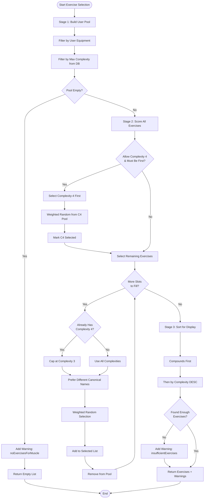
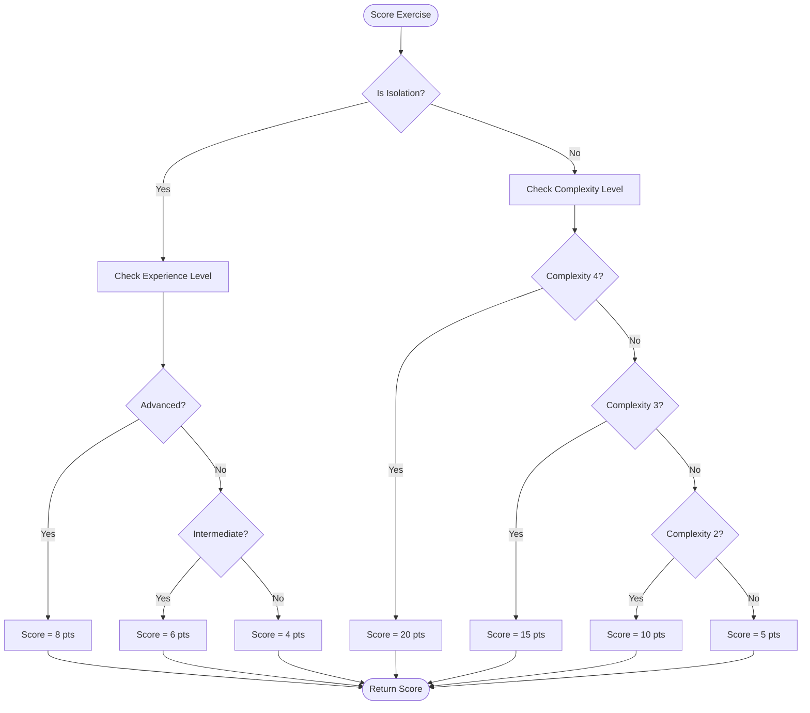
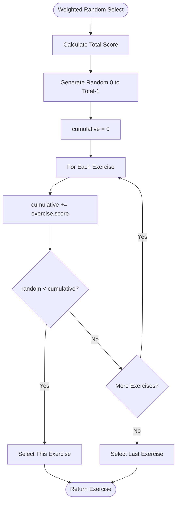
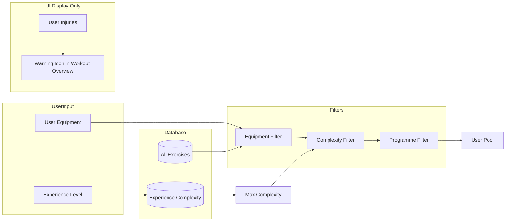
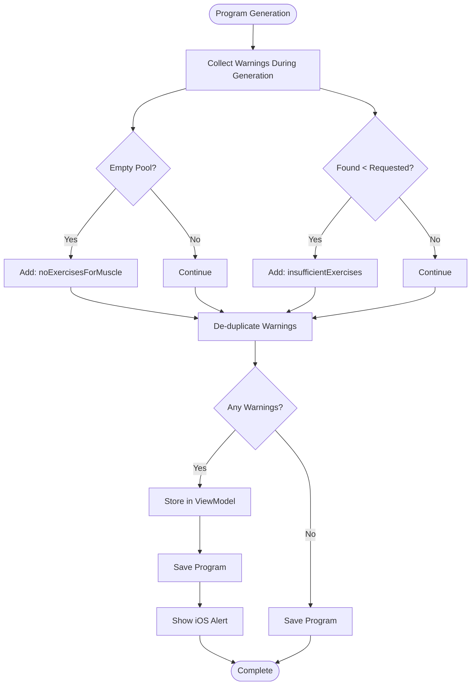

# Exercise Selection Scoring Flowchart

## Overview

This document visualizes the exercise selection algorithm used in the trAIn iOS app's program generator.

## Main Selection Flow

## Scoring Algorithm

## Weighted Random Selection

## User Pool Construction

**Note**: Injuries do NOT filter exercises. They are only used to display warning icons in the Workout Overview UI for exercises that may affect injured areas.

## Warning Flow

**Note**: Injuries are handled separately in the Workout Overview UI, not during program generation.

## Scoring Table Reference

| Type | Condition | Score |
|------|-----------|-------|
| Compound | Complexity 4 | 20 |
| Compound | Complexity 3 | 15 |
| Compound | Complexity 2 | 10 |
| Compound | Complexity 1 | 5 |
| Isolation | Advanced | 8 |
| Isolation | Intermediate | 6 |
| Isolation | Beginner/NoExp | 4 |

## Key Files

| File | Responsibility |
|------|----------------|
| `ExerciseRepository.swift` | buildUserPool(), scoreAndSelectExercises(), sortForDisplay() |
| `DynamicProgramGenerator.swift` | generateProgramWithWarnings(), generateSessionsWithWarnings() |
| `WorkoutViewModel.swift` | Warning alert state, showWarnings() |
| `QuestionnaireView.swift` | Alert presentation via .alert() modifier |

---

**Created**: December 9, 2025
**Version**: 1.0
